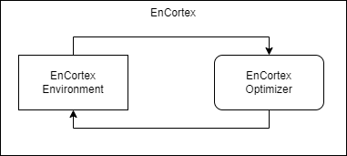

# EnCortex Developer Basics

Each of the below pages cover various topics in the `EnCortex` framework.



## Components

On a high level, a scenario consists of two main components: **Environment** and **Optimizer**. An Environment operates on an *individual Decision Unit* and an optimizer is tasked to sequentially optimize for an environment.

### Environment

````{margin} **Background Knowledge**
```{note}
We recommend familiarizing yourself with [RSOME](https://xiongpengnus.github.io/rsome/) before moving onto understanding environments.
```
````

An environment is created by extending the EnCortex environment class and using the [decorator](https://www.programiz.com/python-programming/decorator) `EnCortexEnv.register`, register your environment so that it is accessible throughout the framework as an additional supported environment. Based on how `EnCortex` is structured, we implement an environment by extending the `EnCortexEnv` class and build an `MILP Environment`. The following points cover what methods are important to be overridden:

1. Now, you need to *manually* implement the following methods to construct the whole environment.
   1. [get_objective_function](../encortex/encortex.env.rst) - Objective function is a function of state and variables. State is a dictionary containing data related to each entity between a certain time referenced by their ID.
   2. [_check_decision_unit_constraints](../encortex/enortex.env.rst) - This function parses the decision unit object and checks if the decision unit is supported by the environment. This is an important step before registering the environment.
   3. [_step](../encortex/encortex.env.rst) - This function dictates things that are necessary to execute an action, calculating rewards, penalties, etc.

For a much more detailed example, refer to [Battery Arbitrage MILP Environment](../encortex/encortex.environments.battery_arbitrage.milp_env.rst) and refer to the comments for an detailed explanation.

Depending on the algorithm, multiple environments must be implemented in order to fit to the algorithms offered within `EnCortex`. The `RL Environment` provides an example why it is necessary to implement a different algorithm.

#### RL Environment

````{margin} **Background Knowledge**
```{note}
We recommend familiarizing yourself with some reinforcement learning terminology, algorithms and gym from [here](https://spinningup.openai.com/en/latest/) before proceeding towards building RL based environments.
```
````

In this case, we take advantage of the fact that RL can be built on top of an MILP environment. To understand this better, let's look at the objective function of the above scenario.

```{math}
:label: battery_arbitrage_objective_with_rl
min \Sigma_t P_t * V_t
```

Here, if every charge decision is denoted by $C$ and every discharge decision is denoted by $D$, assuming we require $V_{charge}$ energy upon charging and supply $V_{discharging}$ upon discharging,
```{math}
V = C*V_{charge} + D*V_{discharge} (C+D==1 and C,D \in {0,1})
```
To accommodate RL, we consider this as a discrete choice problem where 0 indicates charge, 1 indicates idle and 2 indicates discharge. Hence, the transformation from RL to MILP in this scenario is:
```python
if rl_action == 0:
    C, D = 1,0 #charge
elif rl_action == 1:
    C, D = 0, 0 #idle
elif rl_action == 2:
    C, D = 0, 1 #discharge
```
When these constraints are applied, the `gym.space` based action is transformed to MILP based constraints(see the `transform_variable` method in the `BatteryAction` class).

### Decision Unit

A decision unit is a directed graph where each entity is a node on the graph and the contract between the nodes denotes the power flow and dictates the power balance equation. The decision unit object has many utility methods available to operate on the decision as a whole while also giving individual access to each of these components. The next few subsections cover this in-detail.

### Entity

An entity in the decision unit graph is a power component i.e it can be a Source(energy generating unit), a Battery(energy consumer/generating), a Consumer(energy consuming) or a Market(energy bidding) type of component. Each entity has a variable *volume* that denotes how much volume/energy flows at any given time until the next timestep. In EnCortex, the entity comprises of broadly 4 attributes: 1) Config, 2) Action, 3) Data and 4) Schedule. Depending upon the type of entity, there can be additional attributes present which are covered in their individual documentation.

#### Config

A dictionary containing the configuration of the entity. This attribute is used to maintain and access the state of the entity. This is used to save the state of the decision unit and load it dynamically whenever needed.

#### Action

An action for an entity describes the behaviour of the entity at each timestep upon taking certain actions. These actions also account for entity level constraints and have a penalty function associated with each of the actions to penalize wrong/unsafe actions when training neural networks.

### Contract

Contract now defines the terms of a contract between a contractor and a contractee. The default direction of volume is from a contractor to contractee, although it can be made biirectional using the argument `is_bidirectional` argument when initializing a contract. A contract can levy contractual-constraints on the variables. By default, the power balance equation is always maintained within `EnCortex` internally.

### Schedule

A schedule is represented using the Cron grammar to represent a timely schedule.


### Optimizer

The optimizer sequentially solves for the required variables given the environment. Note that the implementation structure for an MILP environment and an RL environment is significantly different because of the different structures.

```{code-block}
:linenos:
:emphasize-lines: 3,4
:caption: Hello

import a
import b

def f(x):
    return x
```