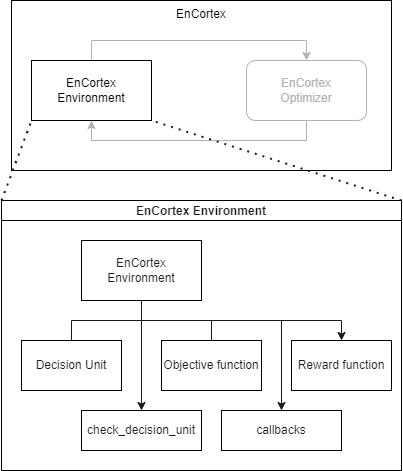

# Creating a new environment

Using Price Arbitrage in a Battery-Grid as an example, this document gives a step-by-step process of writing an Environment using EnCortex.

## Battery Arbitrage

1. Objective function: If $P$ is the price per kilowatthour and the $V$ denotes energy in kWh, the objective function is defined in {eq}`battery_arbitrage_objective`:

```{math}
:label: battery_arbitrage_objective
min \Sigma_t P_t * V_t
```
where $V_t$ is the sum of all the resulting energies based on the charge/discharge decision made of the combined set of batteries.
2.  Penalty: In cases when constraints are not strict(i.e. soft penalty), a "*wrong action*" is penalized after the action is executed.
3.  Objective value: This is the output of the objective function when the state of the decision unit is assumed to be the actual state in tandem with the recommended decisions
4.  Reward: This is the output of the objective function when the state of the decision unit is the actual on-ground data in tandem with the recommended decisions

## Implementing Battery Arbitrage

To implement a scenario, understand the requirements of your algorithm with respect to the relationship between the optimizer's capability and the required actions in an environment. To begin with, we introduce the different component that go into building an environment.



The variables present in this scenario are:

1. The net energy at every timestep to/from the battery .
2. The amount of energy received by the grid from the battery.

Note that while we're presenting a simplistic formulation of this scenario where net energy at every timestep to/from the battery is always equal to the energy received by the grid, complex scenarios are
also possible in other scenarios which rely on promised volumes.

Through the `get_objective_function` method in an `EnCortexEnv` class, we formulate the above equation.


### Implementing Battery Arbitrage - RL Scenario


The challenge with implementing an RL-based scenario is to transform its actions to the expected format. For example, the battery action states that it requires two variables that represent the action - thus, we enforce this constraint as a transformation function and re-use the base scenario's implementation as-is.

The image below represents the typical optimization pipeline and the changes required for the RL implementation.

