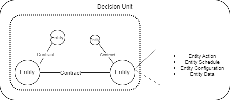

# New Entity



In this page, we describe how to implement a new Entity.

1. Inherit the `Entity` class
2. Define the action space of an `Entity` through `EntityAction`.
3. Define `EntityData`
4. Modify the default schedule behaviour(if any)

Through the `BatteryAction` implementation, we showcase the step-by-step implementation of the `EntityAction`, `SourceData` we cover implementing `EntityData`:

## Battery Action via EntityAction

```{code-block}
:emphasize-lines: 3,4,5,6,7
:linenos:
:caption: Functions to override
:name: action_override

class BatteryAction(EntityAction):

    def __call__(...) # Action behavior of the entity
    def get_action_variable(...) # Action variables for the entity
    def batch_apply_constraints(...) # Apply temporal constraints on a batch of variables
    def transform(...) # Transform MILP to new variables
    def transform_variables(...) # Transform existing variables to fit another action type

```

Following the above implementation:
1. The `__call__` method is executes the battery action: charge, discharge, idle
2. `get_action_variables` specifically describes the relationship between action variables and their final outcomes. Here, the output energy for a given timestep is a function of charge and discharge variables.
3. `batch_apply_constraints` accounts for modeling the constraints of a battery (state of charge >= min_soc, state of charge <= max soc, etc.)
4. `transform` and `transform_variables` help convert other action formats to the [RSOME](https://github.com/XiongPengNUS/rsome) formulation. For the RL implementation, we transform 0 as charge, 1 as idle and 2 as discharge.


## Source Data via EntityData

```{code-block}
:emphasize-lines: 2,4,5
:linenos:
:caption: SourceData override methods

class SourceData(EntityData):
    attribute: DataBackend

    def get_state(...): Data as a state
    def parse_backend(...): Incorporating each of the attribute via the backend
```

### Attributes

```{code-block}
:emphasize-lines: 2,3
:linenos:
:caption: Attributes

class SourceData(EntityData):
    generation_foreacast: DataBackend
    generation_actual: DataBackend

    def get_state(...): Data as a state
    def parse_backend(...): Incorporating each of the attribute via the backend
```

Each attribute is an instance of `DataBackend`, a centralized data-fetching abstraction that queries data on time and supports different storage formats(databases, file formats, etc.). Here, if the source's data is the power generation, we have two attributes `generation_forecast` and `generation_actual` that go into the sourcedata and is later used in the entity.


### get_state

```{code-block}
:emphasize-lines: 4
:linenos:
:caption: state of data from Time A to Time B

class SourceData(EntityData):
    attribute: DataBackend

    def get_state(...): Data as a state
    def parse_backend(...): Incorporating each of the attribute via the backend
```

Dictionary and flattened array of data for this attribute.
