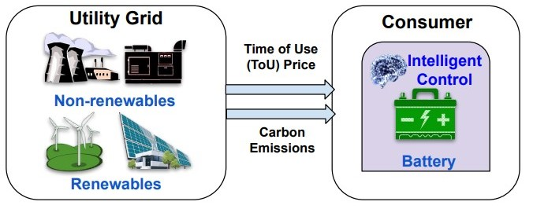

# Energy Arbitrage



In this scenario, a Renewable Energy provider has a Lithium-ion Batteries to it's customers. Now, these batteries are operated(i.e. charged, discharged or maintained-idle) throughout it's operational period in order to maximize cost savings(increase cost savings by charging/discharging the battery at off-peak/peak price periods), carbon emissions savings(by charging/discharging when usage of renewable energy as energy source is high/low) or a weighted-average of both.

Thus, it is important to optimize the management and scheduling of these batteries (when to charge or discharge) to maximize the producer's objective.

## Brief look into EnCortex implementation details

1. The Entities used here are `Battery` and `Grid`, which is an umbrella term for a utility grid.
2. The *action space* or the *decision* in this scenario is to either charge the battery, discharge the battery or letting it stay idle.
3. The supported class of optimizers are `Mixed-Integer Linear Programming` and `Reinforcement Learning`
4. The data in this scenario is only present with the `Grid` entity. The `csv` file format is illustrated in the table below:

```{list-table}
:header-rows: 1
* - timestamps
  - prices
  - emissions
* - 2019-10-20 00:00:00
  - 40.47
  - 116.0
* - ...
  - ...
  - ...
```

For more details, please refer to `Section 5.1` in our paper linked below:
```{button-link} ../_static/nsdi23fall-paper705.pdf
:color: primary
:outline:

EnCortex paper
```

Here, we aim to use the below objective function:

````{eval-rst}
.. math::
    :label: Objective function for Energy Arbitrage

    max \sum_{t=1}^{T}(\omega_{carbon}{Em}_{t} + \omega_{cost}{Cost}_{t} - \omega_{deg}{DegCost}_{t})
````

where $\omega_{field}$ corresponds to relative weight/importance of that field/attribute. The field here are cost savings($Cost_t$), carbon emission savings($Em_t$) and degradation cost associated with the battery($DegCost_t$). The $T$ corresponds to the horizon over which the objective function is maximized.

## Running Energy Arbitrage

To run the Energy Arbitrage experiment, you'll need a specific `config.yaml` file. Create the `config.yml` in your root folder of your AML workspace(as shown below).
<details open>
  <summary><b>battery_arbitrage_config.yml</b>(click to open/close)</summary>

  ```yaml
  #Li-Ion Battery Parameters
  storage_capacity: 10.
  efficiency: 1.
  soc_initial: 1.
  depth_of_discharge: 90.
  soc_minimum: 0.1
  time_unit: 15
  milp_flag: true
  solver: "ort"
  test_flag: false
  min_battery_capacity_factor: 0.8
  battery_cost_per_kWh: 20.
  reduction_coefficient: 0.99998
  degradation_period: 7
  weight_emission: 1.0
  weight_degradation: 0.0
  weight_price: 1.0
  degradation_flag: false
  seed: 40
  ```
</details>

<details>
  <summary><b>Explanation of the above configuration values</b>(click to open)</summary>

  ```{list-table}
  :header-rows: 1

  * - Parameter
    - Description
    - Value
  * - storage_capacity
    - Battery Storage capacity(kWh)
    - 10.
  * - efficiency
    - Battery Charge/Discharge efiiciency
    - 1.
  * - soc_initial
    - SoC initial(Between 0-1)
    - 1.
  * - depth_of_discharge(%)
    - Depth of Discharge
    - 90.
  * - soc_minimum(between 0-1)
    - SoC minimum
    - 0.1
  * - time_unit
    - Minimum time unit in mins
    - 15
  * - milp_flag
    - Use MILP
    - true
  * - solver
    - Solver to use['ort','dqn'(RL)]
    - "ort"
  * - test_flag
    - False
    - false
  * - min_battery_capacity_factor
    - Minimum Battery Capacity Factor
    - 0.8
  * - battery_cost_per_kWh
    - Battery Cost per kWh
    - 20.
  * - reduction_coefficient
    - Battery reduction coefficient
    - 0.99998
  * - degradation_period
    - Degradation period in days
    - 7
  * - weight_emission
    - Emission saving weightage(between 0-1)
    - 1.0
  * - weight_degradation
    - Degradation weightage(between 0-1)
    - 0.0
  * - weight_price
    - Cost saving weightage(between 0-1)
    - 1.0
  * - degradation_flag
    - Flag to enable battery degradation
    - false
  * - seed
    - Seed of the experiment
    - 40
  ```
</details>

### Running via CLI

To run locally, run the following command on your `EnCortex` docker container `bash`(if using [Docker container](setup/docker)) or your terminal/jupyter notebook cell(if installed via [pip](setup/pip))

```bash
python examples/battery_arbitrage_example.py
```

> Visualizations through the CLI can only be viewed when run locally(through Streamlit). The final numbers are visible in the logs.


Other variations of the configuration can be found below. In the tab mentioned `Degradation(enabled)`, the degradation of a battery during charge/discharge cycles is considered and is enabled by the setting flag `degradation_flag` as `true`.

````{eval-rst}
.. tabs::

   .. tab:: Degradation(disabled)
      **config.yml**

      .. code:: yaml

        storage_capacity: 10.
        efficiency: 1.
        soc_initial: 1.
        depth_of_discharge: 90.
        soc_minimum: 0.1
        time_unit: 15
        milp_flag: true
        solver: "ort"
        test_flag: false
        min_battery_capacity_factor: 0.8
        battery_cost_per_kWh: 20.
        reduction_coefficient: 0.99998
        degradation_period: 7
        weight_emission: 1.0
        weight_degradation: 0.0
        weight_price: 1.0
        degradation_flag: true
        seed: 40
   .. tab:: Degradation(enabled)
      **config.yml**

      .. code:: yaml

        storage_capacity: 10.
        efficiency: 1.
        soc_initial: 1.
        depth_of_discharge: 90.
        soc_minimum: 0.1
        time_unit: 15
        milp_flag: true
        solver: "ort"
        test_flag: false
        min_battery_capacity_factor: 0.8
        battery_cost_per_kWh: 20.
        reduction_coefficient: 0.99998
        degradation_period: 7
        weight_emission: 1.0
        weight_degradation: 0.0
        weight_price: 1.0
        degradation_flag: false
        seed: 40
````
## Running on an [AML notebook](run/azureml-notebooks)

We also provide a notebook to ease modification and help visualize your results(click on the button below).

```{button-link} ../notebooks/energy_arbitrage.ipynb
:color: primary
:shadow:

Energy Arbitrage Notebook
```

To run the notebook:

1. Download the notbook from this documentation(download button {octicon}`download;1em;sd-text-info` on the top of the page) and upload the notebook to AML studio
2. Connect to your compute instance(see [setup](setup/azureml/compute))
3. Select `Python3.8 - AzureML` as your environment
4. Run the pip instructions to install `EnCortex` (see [setup](setup/pip))

> Results and visualizations can be viewed directly on the notebook.

````{margin}
```{note}
   This is a one-time setup. As long as the compute environment is not changed, this step can be ignored after the first installation.
```
````

