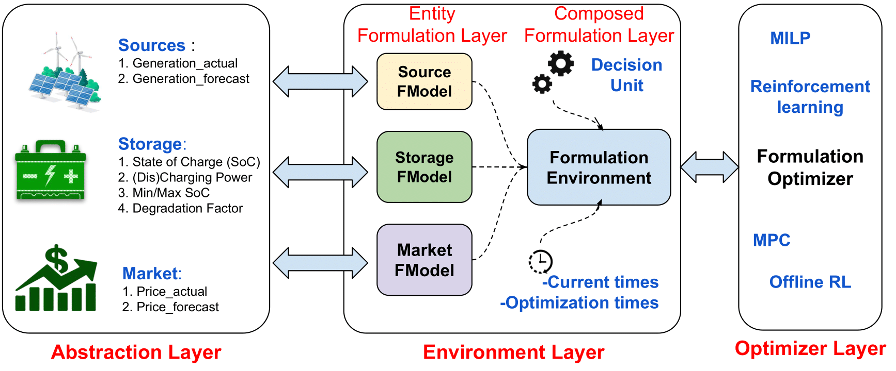

# Tutorial

In this section, we show how you can run pre-defined scenarios supported right out-of-the-box by `EnCortex`. Later, we also show how to define custom scenarios. Before proceeding, we highly recommend installing `EnCortex` and setting up your AML environment, as shown [here](../introduction/setup.md)



Each scenario involves three layers of EnCortex:

1. Abstractions, Entities and Data
2. Scenario Composition through Environments
3. Optimization


## Abstraction and Entities

**Abstraction:** Abstraction refers the broad definitions of how each resource i.e. energy source, a market, consumer are expected to be specified.
**Entity:** An entity specifically inherits the corresponding abstractions to specify their behaviour
**Data:** Data is central to each entity(if applicable)

## Environments

The key purpose of this layer is to provide data and state information from entities(called state space) that are needed to make a decision and a central point to orchestrate all the required decisions based on the schedule (termed as action space). The environment layer has an entity-specific component called the Entity Formulation Layer which exposes the micro variables like volume output, emission output, etc. in a uniform API to the environment. The decision unit identified (Section 3.1.3) is used as an input along with the entity formulation layer and a user-specified optimization horizon to generate the formulation environment. This layer identifies the time period for which models have to be built, maintains the current time in simulation and incorporates all the variables and actions that are required to solve the optimization for this particular time period. This environment composes the scenario based on the decision unit under consideration (called the Composed Formulation Layer) to expose the macro variables like revenue, penalty, transmission penalty, emissions, etc. When an action is executed in simulation, the agents receive a reward indicating how they’ve performed on a singular instance of the objective function that needs to be maximized.


## Optimizer

An optimizer layer finally uses the environment layer outputs (revenue, penalty, transmission penalty, emissions, etc.) for every timestamp and runs the optimization based on the objective defined (e.g., monetization). EnCortex provides native support for various state-of-the-art algorithms apart from bringing your own optimizer code. The energy operator can run numerous experiments to determine which algorithm provides the best optimal schedules while maximizing the objectives. The supported algorithms include Simulated Annealing (SA), Mixed Integer Linear Programming (MILP), and Deep Q Network-based Reinforcement Learning (DQN-RL), contingent on the scenario.

In the next sections, we dive deep into each of the scenarios - covering requirements and instructions on running them on AML.


```{toctree}
:titlesonly:
:glob:

battery_arbitrage
microgrid
configurations
```